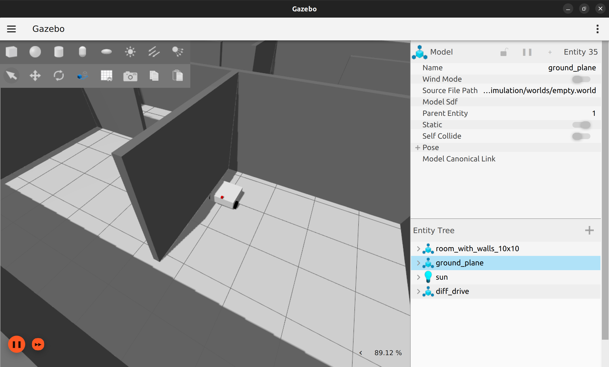
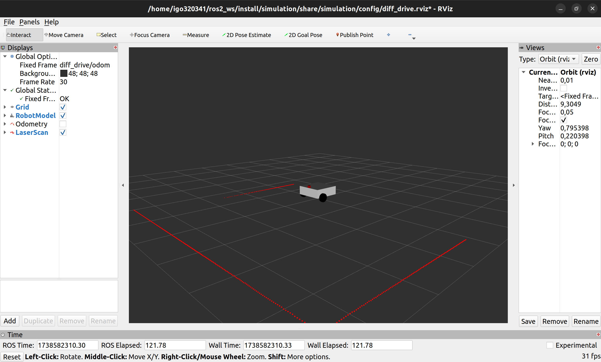
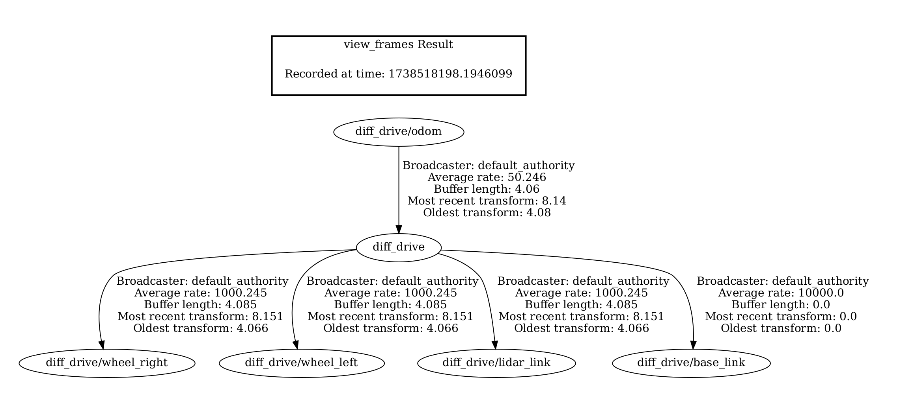

# ROS 2 + Gazebo Ignition Diff Drive Simulation

Make sure you have `nav2` installed

**This package was tested in combination with ROS Humble and Gazebo Fortress**

```
ros2 launch simulation simulation.launch.py
```



