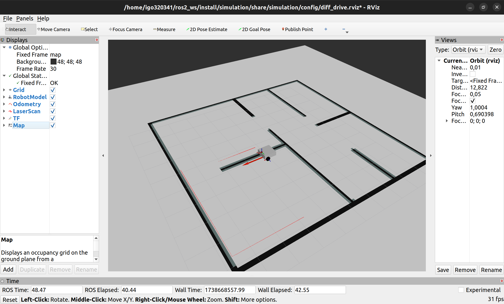
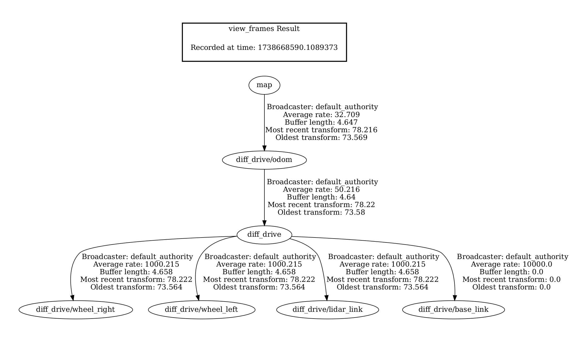

# ROS 2 + Gazebo Ignition Diff Drive Simulation

Make sure you have `nav2` installed

This package uses my localization package [pf_localization](https://github.com/igo320345/pf_localization). You can replace it with another packages(e.g. nav2_amcl). But make sure you have `map` -> `diff_drive/odom` transform.

**This package was tested in combination with ROS Humble and Gazebo Fortress**

```
ros2 launch simulation simulation.launch.py
```



